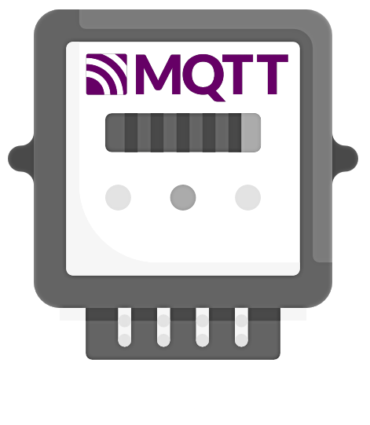

# **rpict-mqtt** <small>4.0.0-beta.6</small>

> Modern RPICT to MQTT Bridge for Home Energy Monitoring

- 🏠 Native Home Assistant integration
- ⚡ Real-time power & energy monitoring
- 🐳 Available as Docker container & Home Assistant add-on
- 🔌 Supports all RPICT models
- 🚀 Easy setup & configuration

[GitHub](https://github.com/gtricot/rpict-mqtt)
[Docker Hub](https://hub.docker.com/r/gtricot/rpict-mqtt)
[Get Started](introduction/)

<!-- background color -->

