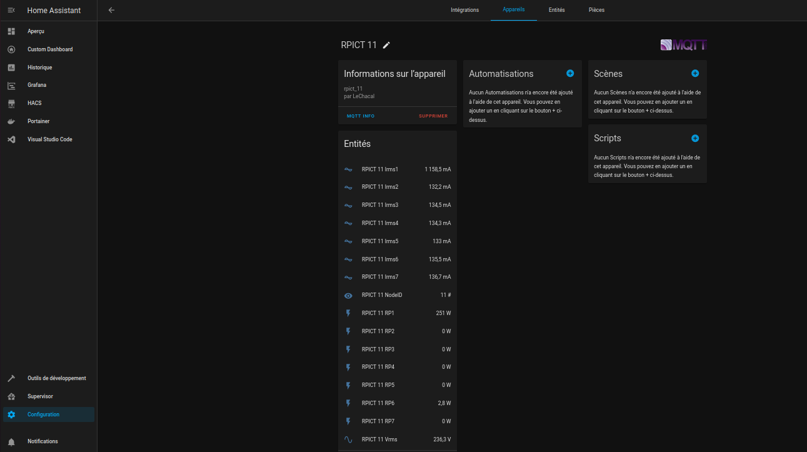

# Home Assistant Integration

## Installation Options

You can integrate RPICT-MQTT with Home Assistant in two ways:

### 1. Home Assistant Add-on (Recommended)

RPICT-MQTT is available as a Home Assistant add-on. To install:

1. Add our repository to your Home Assistant add-on store:
   - Navigate to Settings → Add-ons → Add-on Store
   - Click the ⋮ menu in the top right
   - Select "Repositories"
   - Add: `https://github.com/gtricot/hassio-addons`

2. Install the "RPICT MQTT" add-on
3. Configure the add-on with your RPICT settings
4. Start the add-on

### 2. Docker Container

You can also run RPICT-MQTT as a standalone Docker container and connect it to Home Assistant through MQTT. See the [Configuration](configuration/) section for Docker setup instructions.

## MQTT Discovery

Home Assistant automatically discovers RPICT sensors using [MQTT Discovery](https://www.home-assistant.io/docs/mqtt/discovery/).

?> **Discovery Settings**
- Enabled by default
- Can be disabled with [`HASS_DISCOVERY=false`](configuration/)
- Discovery prefix can be customized with [`HASS_DISCOVERY_PREFIX`](configuration/)

## Device and Entities

After setup, you'll find your RPICT device in Home Assistant:

1. Go to Settings → Devices & Services
2. Look under "MQTT integrations"
3. Find your device named `RPICT <NodeId>` (e.g., "RPICT 11")

Each RPICT measurement appears as a separate sensor entity:

### Available Entities

The number and type of entities depend on your RPICT model:
- Voltage sensors (V)
- Current sensors (A)
- Power sensors (W)
- Energy sensors (kWh)
- Power factor sensors (%)

?> Each measurement from your RPICT device creates a separate sensor entity with appropriate units and device class for optimal Home Assistant integration.
